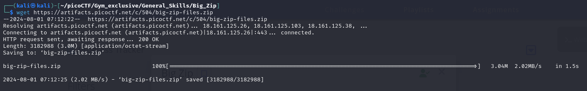
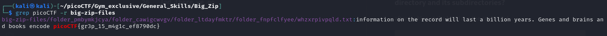

# PicoCTF - Gym Exclusive - General Skills - Big Zip - Easy 
## Date: 01/08/2024
> Unzip this archive and find the flag.

We are give a zip file with a flag in it. We need to Unzip it and find the flag.

I download the zip file from the link.
```bash
wget https://artifacts.picoctf.net/c/504/big-zip-files.zip
```


---
I unzip the file with -q since i don't want to see all the files being listed.
```bash
unzip -q big-zip-files.zip
```
### Hint 1: Can grep be instructed to look at every file in a directory and its subdirectories?

after looking at the hint I run the command 
```bash
grep picoCTF -r big-zip-files.zip
```
This command basically searches for the string 'picoCTF' in every file in the directory and its subdirectories.

And there we go


### Flag : picoCTF{gr3p_15_m4g1c_ef8790dc}